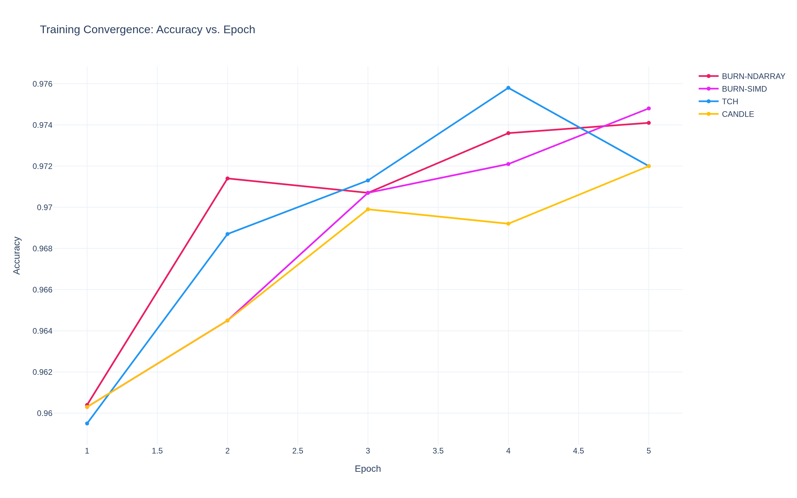
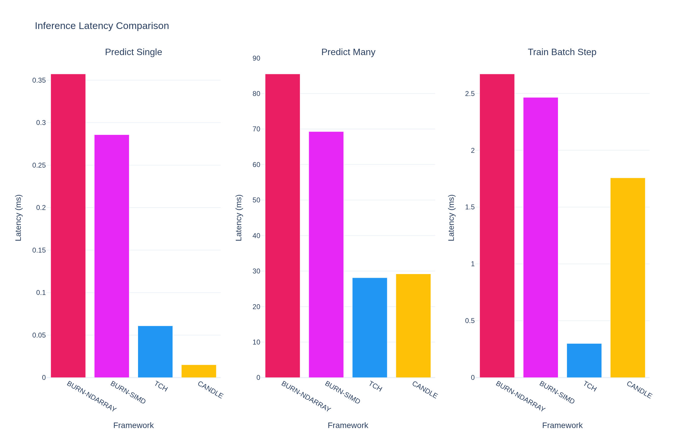
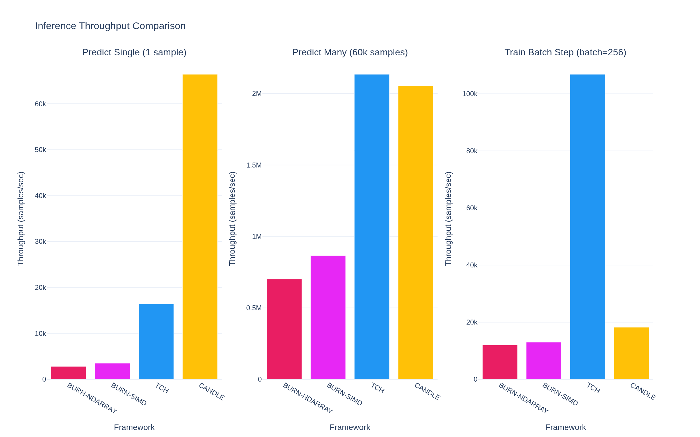
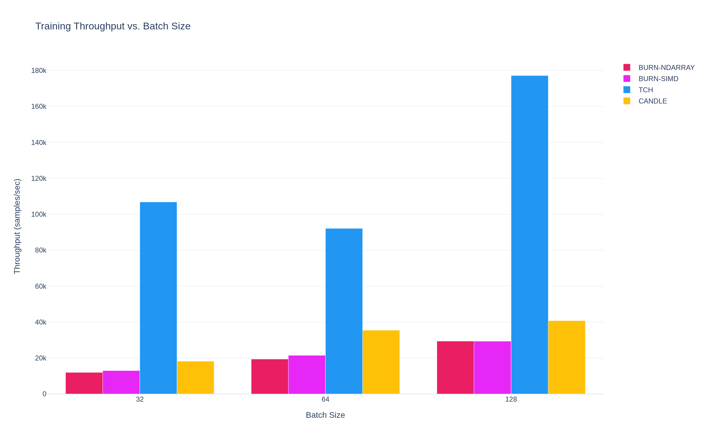
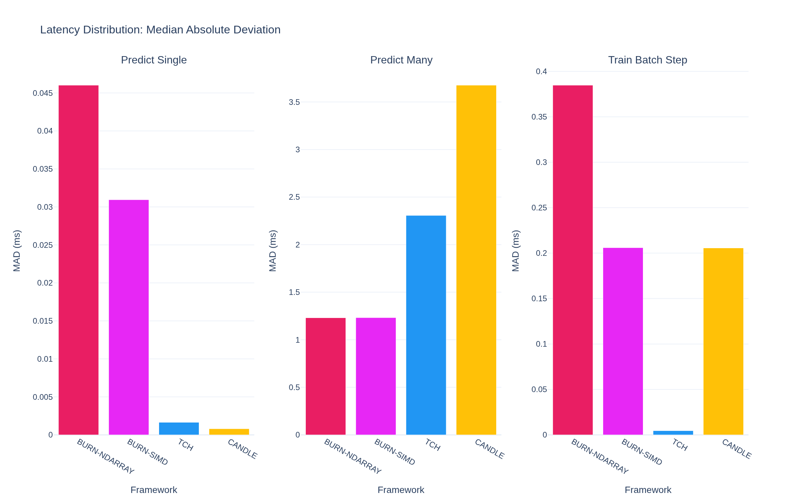

# Rust ML Frameworks Benchmark Suite

A comprehensive Python-based benchmarking and visualization suite for comparing Rust ML frameworks.

## Overview

This suite runs benchmarks for three Rust machine learning frameworks:

- **Burn** - Pure Rust ML framework with multiple backend support
- **TCH-rs** - Rust bindings for PyTorch
- **Candle** - Hugging Face's Rust ML framework

All three frameworks are benchmarked on the same task: **MNIST digit classification** using a 2-layer neural network (784→256→10).

## Model Architecture

The benchmark uses a simple 2-layer neural network:

- **Input layer:** 784 neurons (28×28 MNIST images flattened)
- **Hidden layer:** 256 neurons with ReLU activation
- **Output layer:** 10 neurons (digit classes 0-9) with softmax
- **Optimizer:** Adam with learning rate 0.01
- **Batch size:** 256 (except for explicit batch size experiments)

### Benchmarking Focus: CPU Performance

⚠️ **Important:** This benchmark suite focuses exclusively on **CPU performance**. All three frameworks are configured to run on CPU:

- **Burn** - Tested with three CPU backends:
  - `ndarray` - Pure Rust BLAS-free implementation
  - `ndarray-openblas` - With OpenBLAS acceleration
  - `ndarray-simd` - With SIMD optimizations
- **TCH-rs** - Configured for CPU inference/training
- **Candle** - Runs on CPU (GPU support available but not configured)

GPU acceleration is **not enabled** for this benchmark. Results measure CPU-bound compute performance and are not indicative of GPU performance. If you need GPU benchmarks, framework-specific GPU backends can be configured separately.

## Experiments & Benchmarks

This suite runs **4 distinct experiments** to comprehensively evaluate framework performance:

### Experiment 1: Training Convergence (Binary Execution)

**What it measures:** How quickly each framework trains the MNIST classifier over 5 epochs.

**Configuration:**

- Epochs: 1 to 5 (incremental - each run trains from scratch for N epochs)
- Num workers: 8

---

### Experiment 2: Single-Sample Inference Latency

**What it measures:** How long it takes to classify a single MNIST image.

**Configuration:**

- Benchmark name: `predict_single`
- Input: One flattened 784-dimensional MNIST image
- Sample size: 100 measurements with 3 second warm-up and 5 second measurement time

---

### Experiment 3: Batch Inference Throughput

**What it measures:** How long it takes to classify 10,000 MNIST images in a batch.

**Configuration:**

- Benchmark name: `predict_many`
- Input: All 10,000 test MNIST images (~31.4 MB)
- Sample size: 100 measurements with 3 second warm-up and 5 second measurement time

---

### Experiment 4: Training Step Performance (Variable Batch Sizes)

**What it measures:** Forward pass + backward pass + optimizer step time at different batch sizes.

**Configuration:**

- Benchmark name: `train_batch`
- Input: Random dummy data to isolate compute performance
- Batch sizes: 32, 64, 128
- Sample size: 20 measurements with 3 second warm-up and 5 second measurement time

## Setup

### Prerequisites

- Python 3.12+
- Rust toolchain
- UV package manager
- **Environment variable:** `LIBTORCH_USE_PYTORCH=1` (required for TCH-rs framework)

### Installation

```bash
uv sync
uv pip install torch==2.9.0
export LIBTORCH_USE_PYTORCH=1
```

## Usage

```bash
# Run benchmarks for all three frameworks
# Results stored in results/{YYYY-MM-DD_HH-MM-SS}/
uv run python run_benchmarks.py
```

The benchmark script will:

1. Run `cargo run --release` for each framework → generates convergence data
2. Run `cargo bench` for each framework → generates performance metrics
3. Parse all outputs and standardize units
4. Save timestamped results in `results/` directory
5. **Abort immediately if ANY framework fails** (no partial results, no retries)

Then generate visualizations:

```bash
# Generates plots from the latest benchmark run
uv run python visualize_results.py
```

Output includes:

- **Visualizations** (saved to `visualizations/{run_timestamp}/`):
  - `01_convergence_curves.png` - Training accuracy over epochs (line plot)
  - `02_inference_latency.png` - Inference latency comparison across all benchmarks (grouped bars)
  - `02b_inference_throughput.png` - Inference throughput with separate batch size labels (grouped bars)
  - `03_training_throughput.png` - Training throughput vs. batch size (32, 64, 128) (grouped bars)
  - `04_latency_distribution.png` - Latency distribution (MAD) across benchmarks (bars)

- **Data Exports** (CSV format):
  - `convergence_data.csv` - Epoch-by-epoch training data
  - `benchmark_metrics.csv` - All metrics with confidence intervals
  - `summary.csv` - Overall statistics per framework
  - `speedup_ratios.csv` - Relative performance vs. baseline (Burn)

## Performance Notes

- **Total runtime:** ~10-30 minutes depending on machine and configuration
  - Cargo build/check: ~2-5 min per framework
  - Binary execution: ~3-8 min per framework
  - Criterion benchmarks: ~2-5 min per framework
  
- **Criterion defaults:**
  - 100 samples per benchmark
  - 3 second warm-up
  - 5 second measurement time
  - 95% confidence level

## Latest Results: 2026-03-27

**Benchmark Suite Run:** `2026-03-27_11-50-27`

**System Information:**

- **Timestamp:** 2026-03-27T11:50:27.541105
- **Git Commit:** `aaa14e6a4e60f64b0af2c0cb128547243fbc1a1d`
- **Rust Version:** rustc 1.93.0-nightly (c86564c41 2025-11-27)

**Frameworks Tested:**

- burn-example-ndarray
- burn-example-simd
- burn-example-openblas
- tch-example
- candle-example











## License

This project is licensed under the **MIT License**. See the [LICENSE](LICENSE) file for the full text.
